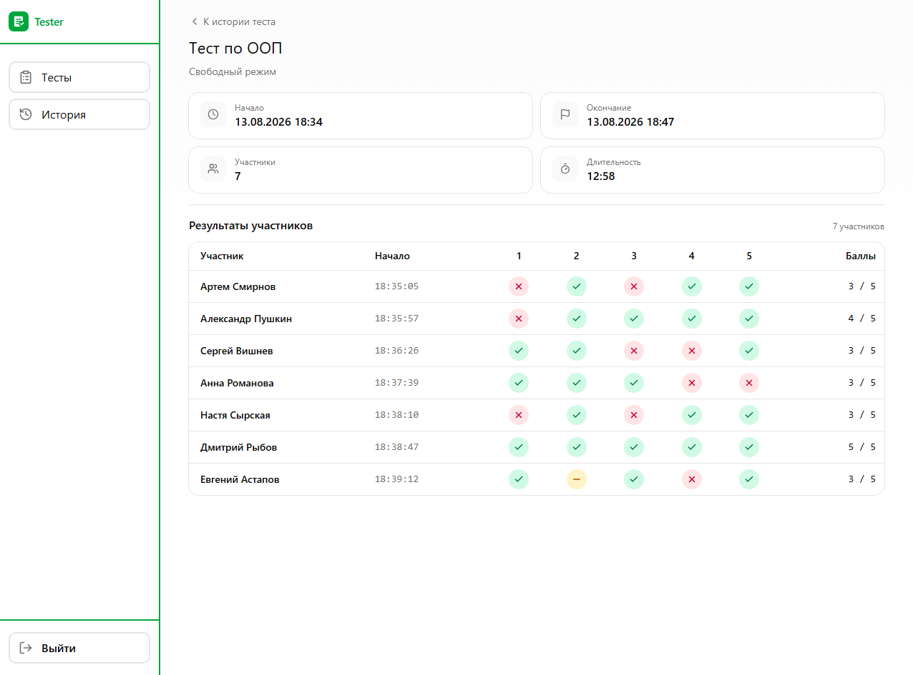
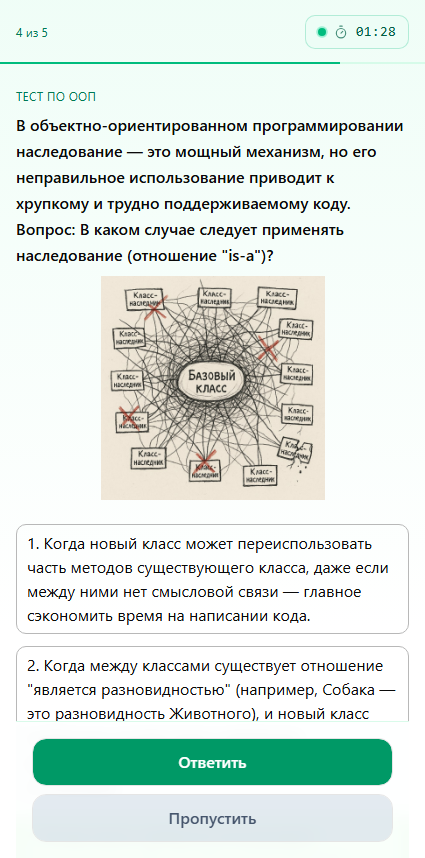

# Tester

Веб-приложение для создания тестов и их проведения: вопросы (ввод, один/несколько вариантов), запуск сессии вручную или по расписанию, регистрация участников, ответы в реальном времени по WebSocket, QR-ссылка на тест, история и обзор результатов.

Репозиторий состоит из `client` (SPA), `server` (API + WebSocket) и `proxy` (Nginx).

## Скриншоты

Панель ведущего: просмотр результатов теста.



Экран участника: вопрос теста с вариантами ответа.



## Стек

**Клиент:** React 19, TypeScript, Vite, Feature-Sliced Design, Tailwind CSS, shadcn/Radix, TanStack Query, Zustand, React Hook Form + Zod, Axios (клиент из OpenAPI), React Router, i18next.

**Сервер:** Node.js, Express 5, TypeScript, Inversify, Prisma, PostgreSQL, JWT, WebSocket (`ws`), Swagger, class-validator.

**Инфра:** Docker Compose, Nginx, PM2 (в контейнере сервера).

## Запуск через Docker

Нужны Docker и Docker Compose.

```bash
cp .env.example .env
docker compose up --build
```

Полная пересборка образов без кэша:

```bash
docker compose build --no-cache
docker compose up
```

Приложение будет доступно на `http://localhost:8080` (порт задаётся `PROXY_PORT` в `.env`).

Прокси отдаёт UI, `/api` и `/uploads` на сервер, `/ws` — WebSocket.

Перед первым запуском замените секреты JWT в `.env`. Миграции Prisma применяются при старте контейнера `server`.

## Локальная разработка

Нужны Node.js 22+ и PostgreSQL.

1. Поднимите PostgreSQL и задайте `DATABASE_URL` (для локального запуска — `localhost`, не hostname `postgres` из Docker).
2. Сервер:

```bash
cd server
npm install
npx prisma migrate deploy
npm run dev
```

API: `http://localhost:8031`.

3. Клиент — переменные Vite (`VITE_API_URL`, `VITE_SERVER_URL`, `VITE_WS_URL`), например API `http://localhost:8031/api` и WS `ws://localhost:8031/ws`:

```bash
cd client
npm install
npm run dev
```

UI: `http://localhost:5173`.
